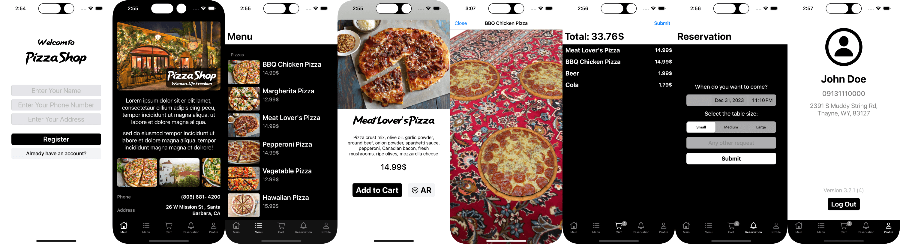

<h1><strong>🍕 Pizza Shop 🍕</strong></h1>

 

PizzaShop is a food ordering iOS app that allows users to browse the menu, order pizza and beverages, book a table, and view the pizzas in augmented reality. It is built with the latest iOS technologies, including SwiftUI, MapKit, ARKit, CoreData, and MVVM architecture. It also has a Node.js server with automated testing and deployment.

- [Website](https://pizzashop-server.cyclic.app )
- [Node.js Server Repository](https://github.com/armanabkar/pizza_shop_server)

## Features

- [x] Authentication system (Register/Login)
- [x] Home screen built with ****SwiftUI**** and MapKit
- [x] Menu screen with categories and detail for each item (UITableView)
- [x] Cart built with Core Data
- [x] Reservation screen
- [x] Profile Page: UI from code (no storyboard)
- [x] ARKit support for viewing pizza in augmented reality (AR)
- [x] Notification and Observer pattern (NotificationCenter) for updating Cart's badge
- [x] Haptic Feedbacks
- [x] Async image loader + Caching
- [x] Custom UI Alerts
- [x] Unit/Integration Tests
- [x] Async/Await network requests
- [x] MVVM Architecture
- [X] Custom font for logo
- [x] [@UseAutoLayout](https://medium.com/@armanabkar/useautolayout-ef063bf39c3)
- [x] Widget for offers (Work in progress)
- [ ] Push Notifications
- [ ] UI Tests
- [Total lines of code](https://medium.com/@armanabkar/how-to-calculate-total-lines-of-code-in-xcode-projects-6d5a826f7d30): 2613
- External Dependencies: None
- Requires **iOS 17.0** or later.

### Contributing

We appreciate your help!
